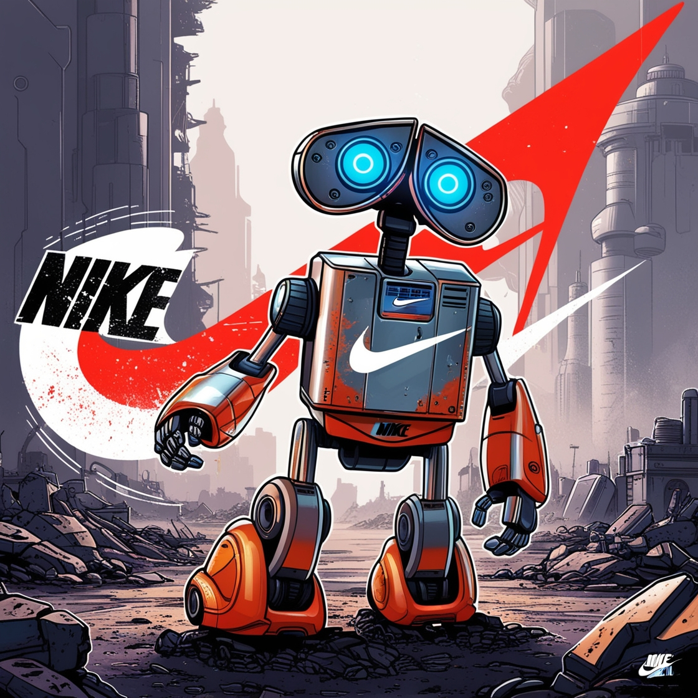

<h1>🌟 Apresento com alegria o projeto EasyBuy! 🚀 </h1>

Este é um revolucionário bot de compras online que desenvolvi com muito entusiasmo! 🛒✨ Imagine poder realizar suas compras de forma rápida e simples, sem levantar um dedo. 💻🛍️ Com o EasyBuy, você pode contar com um assistente virtual que faz todo o trabalho pesado por você!

O EasyBuy é projetado para otimizar e acelerar suas aquisições na internet. Em apenas 11 segundos, ele realiza todas as etapas essenciais da compra de forma eficiente e precisa. Desde fazer login na sua conta, acessar a página do item desejado, selecionar o tamanho ou número, adicionar ao carrinho, preencher suas informações de pagamento e envio, até finalizar a compra - tudo isso em um piscar de olhos! ⏱️✨

Nosso objetivo é oferecer uma experiência de compra eficiente e emocionante, onde cada interação é uma oportunidade para adquirir seus produtos favoritos sem complicações. 🌟🛒✨

Desenvolvido com tecnologias de ponta, como Python, Selenium e automação avançada, o EasyBuy é mais do que um bot - é o seu assistente pessoal de compras, sempre pronto para agilizar suas aquisições. 🌐🤖✨ Junte-se a nós nesta jornada emocionante e comece a comprar de uma maneira totalmente nova! 🚀🛍️✨

Ah, e não posso deixar de mencionar que todo o projeto é focado na velocidade e precisão, proporcionando uma experiência única de compras online! 🏎️💨✨

      Estamos felizes em informar que o bot foi finalizado com sucesso. Agora você pode utilizá-lo tranquilamente para desfrutar de todas as suas funcionalidades e recursos. Agradecemos por sua paciência e apoio durante este processo. Se tiver alguma dúvida        ou feedback, não hesite em nos contatar. Esperamos que sua experiência com o EasyBuy seja agradável e produtiva!

